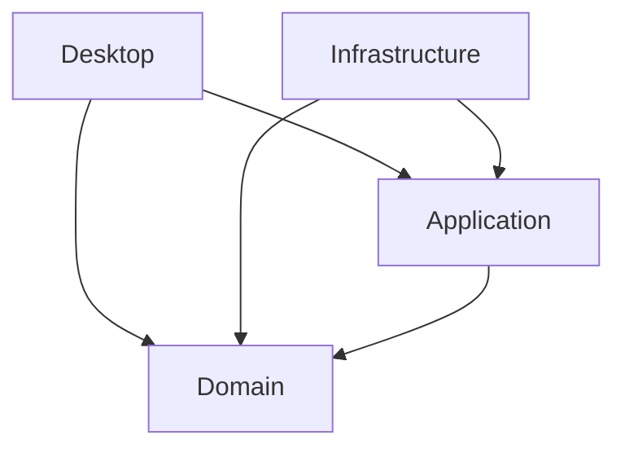

# Logische Sicht (Logical View) — DJORGA

> **Kruchten 4+1:** Die logische Sicht beschreibt die funktionale Zerlegung
> des Systems in Schichten, Pakete und Schlüsselklassen sowie ihre statischen
> Beziehungen. Zielgruppe: Entwickler, Architekten.

---

## 1. Schichtenmodell (Clean Architecture)

DJORGA folgt der Clean Architecture nach Robert C. Martin. Die Abhängigkeiten
zeigen ausschließlich **nach innen** (Dependency Rule). Äußere Schichten kennen
innere Schichten — nicht umgekehrt.

```
┌─────────────────────────────────────────────┐
│  Desktop  (Avalonia UI, MVVM)               │  ← Presentation
│  ┌─────────────────────────────────────┐    │
│  │  Infrastructure  (EF Core, TagLib)  │    │  ← Frameworks & Drivers
│  │  ┌─────────────────────────────┐    │    │
│  │  │  Application  (Use Cases)   │    │    │  ← Application Business Rules
│  │  │  ┌─────────────────────┐    │    │    │
│  │  │  │  Domain  (Entities) │    │    │    │  ← Enterprise Business Rules
│  │  │  └─────────────────────┘    │    │    │
│  │  └─────────────────────────────┘    │    │
│  └─────────────────────────────────────┘    │
└─────────────────────────────────────────────┘
```

---

## 2. Layer-Beschreibungen

### DJORGA.Domain
**Zweck:** Kern-Geschäftslogik, frei von jeglichen Framework-Abhängigkeiten.

| Klasse / Typ | Beschreibung |
|:---|:---|
| `Track` | Zentrale Entität: Titel, Artist, BPM, Key, Mood, TimeContext |
| `Playlist` | Geordnete Sammlung von Track-Referenzen |
| `SmartCollection` | Regel-basierte dynamische Track-Menge |
| `CamelotKey` | Value Object: Camelot-Notation, Kompatibilitätslogik |
| `TrackMood` | Enum: 8 emotionale Energiestufen |
| `TrackTimeContext` | Enum: 8 Tageszeitkontexte |
| `FilterRule` | Value Object: Eigenschaft + Operator + Wert |
| `ScoringWeights` | Value Object: konfigurierbare Scoring-Gewichte *(E-024)* |

### DJORGA.Application
**Zweck:** Anwendungsfälle und Interfaces. Orchestriert die Domain.

| Klasse / Typ | Beschreibung |
|:---|:---|
| `ImportRekordboxXmlUseCase` | Import von Rekordbox XML in die lokale DB |
| `UpdateTrackMetadataUseCase` | Aktualisiert Metadaten eines Tracks |
| `HarmonicSequenceBuilderService` | Greedy-Algorithmus zur Track-Sequenz *(E-027)* |
| `HarmonicScoringService` | Key + BPM + DNA Kompatibilitätsscoring |
| `RuleEvaluatorService` | LINQ-Expression-basierte Regelauswertung |
| `BackgroundAnalysisService` | Hintergrundanalyse (Waveform-Peaks) |
| `ITrackRepository` | Interface: CRUD für Tracks |
| `ISequenceBuilder` | Interface: Track-Sequenz-Erzeugung *(E-027)* |
| `IMetadataService` | Interface: Metadaten aus Dateisystem lesen |

### DJORGA.Infrastructure
**Zweck:** Implementierung externer Concerns (DB, Dateisystem, externe APIs).

| Klasse / Typ | Beschreibung |
|:---|:---|
| `SqliteTrackRepository` | EF Core + SQLite Implementierung von `ITrackRepository` |
| `AppDbContext` | EF Core DbContext, Schema-Definition |
| `RekordboxXmlReader` | Parser für `rekordbox.xml` |
| `TagLibMetadataService` | Metadaten aus MP3/FLAC via TagLib# |
| `NAudioWaveformGenerator` | Waveform-Peak-Extraktion via NAudio |

### DJORGA.Desktop
**Zweck:** Avalonia UI Presentation Layer, MVVM Pattern.

| Klasse / Typ | Beschreibung |
|:---|:---|
| `MainViewModel` | Root-ViewModel, Navigation-Koordination |
| `LibraryViewModel` | Track-Liste, Suche, Sortierung |
| `TrackViewModel` | UI-Wrapper für Track-Entity *(E-022)* |
| `AIBuilderViewModel` | Sequence-Builder UI-Logik |
| `HarmonicMapViewModel` | Camelot-Key-Visualisierung |
| `SmartCollectionEditorViewModel` | Regeleditor für Smart Collections |
| `PlayerViewModel` | Audio-Player-Steuerung |
| `DnaPickerControl` | Custom Control: 8x8 Mood×TimeContext Grid |
| `WaveformControl` | Custom Control: SkiaSharp Waveform-Rendering |

---

## 3. Abhängigkeitsdiagramm

> *Platzhalter — Diagramm mit draw.io oder Mermaid zu ergänzen.*



---

## 4. Wichtige Design-Entscheidungen

- **Repository Pattern:** `ITrackRepository` entkoppelt Application von SQLite.
- **Use Case / Interactor:** Jede Geschäftsaktion ist eine eigenständige Klasse.
- **Value Objects sind immutable:** `CamelotKey`, `FilterRule`, `ScoringWeights`.
- **Domain ist frei von UI-Abhängigkeiten:** Kein `INotifyPropertyChanged` in Entities *(nach E-022)*.

---

*Zugehörige ADRs: [ADR-001](../../adr/001_clean_architecture_upgrade.md), [ADR-002](../../adr/002_use_community_toolkit_mvvm.md)*
