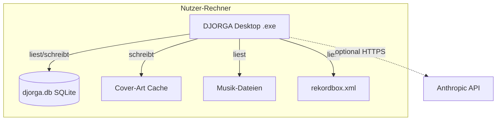

# Physische Sicht (Physical View) — DJORGA

> **Kruchten 4+1:** Die physische Sicht beschreibt die Deployment-Topologie:
> Wo läuft welche Software, welche Dateien liegen wo auf dem Rechner, welche
> externen Systeme werden kontaktiert. Zielgruppe: Entwickler, Nutzer, Support.

---

## 1. Deployment-Topologie

DJORGA ist eine reine **Single-Machine-Desktop-Anwendung**. Es gibt keinen
Server, keine Cloud-Abhängigkeit (im MVP). Alle Daten bleiben lokal.

```
┌─────────────────────────────────────────────────────────────┐
│  Nutzer-Rechner (Windows / macOS / Linux)                   │
│                                                              │
│  ┌──────────────────────────────────────────────────────┐   │
│  │  DJORGA.Desktop.exe  (Avalonia .NET 8 Prozess)       │   │
│  │                                                       │   │
│  │   ┌────────────────┐  ┌──────────────────────┐       │   │
│  │   │  Application   │  │   Infrastructure     │       │   │
│  │   │  Logic         │  │   (EF Core, TagLib,  │       │   │
│  │   └────────────────┘  │   NAudio, SkiaSharp) │       │   │
│  │                       └──────────────────────┘       │   │
│  └──────────────────────────────┬───────────────────────┘   │
│                                 │ liest/schreibt             │
│                ┌────────────────┼────────────────────┐      │
│                ▼                ▼                     ▼      │
│         djorga.db         Cover-Art-Cache      Musik-Dateien │
│         (SQLite)          (temp/AppData)       (originale,   │
│                                                 read-only)   │
│                                                              │
│  ┌────────────────────┐                                      │
│  │  rekordbox.xml     │  ← Manuell vom Nutzer exportiert     │
│  │  (Import-Quelle)   │                                      │
│  └────────────────────┘                                      │
└─────────────────────────────────────────────────────────────┘
                              │
                    (optional, zukünftig)
                              │
                 ┌────────────▼────────────┐
                 │  Anthropic Claude API   │
                 │  (LLM für Sequence-     │
                 │   Builder, opt. E-027)  │
                 └─────────────────────────┘
```

---

## 2. Dateisystem-Pfade (Laufzeit)

| Artefakt | Pfad (Windows Beispiel) | Beschreibung |
|:---|:---|:---|
| SQLite-Datenbank | `%APPDATA%\DJORGA\djorga.db` | Alle Tracks, DNA, Collections |
| Cover-Art-Cache | `%APPDATA%\DJORGA\covers\` | Extrahierte Cover-Bilder (temp) |
| Logs | `%APPDATA%\DJORGA\logs\` | Anwendungslogs *(nach E-025)* |
| Rekordbox XML | Frei wählbar vom Nutzer | Import-Quelle, read-only |
| Musik-Dateien | Frei wählbar vom Nutzer | MP3/FLAC, nur gelesen |

> *Genaue Pfade werden in `AppStateService` konfiguriert und sind
> betriebssystemspezifisch.*

---

## 3. Externe Systemgrenzen

| System | Verbindung | Zweck | Status |
|:---|:---|:---|:---|
| Rekordbox | Datei (XML) | Bibliotheks-Import | MVP, vorhanden |
| Dateisystem | lokal | Metadaten & Waveform lesen | MVP, vorhanden |
| Anthropic Claude API | HTTPS | LLM-basierter Sequence Builder | Optional, geplant (E-027) |

**Wichtig:** Im MVP gibt es **keine** Netzwerkverbindungen. Alle Operationen sind lokal.

---

## 4. Deployment-Diagramm

> *Platzhalter — Diagramm mit draw.io oder Mermaid zu ergänzen.*



---

*Zugehörige ADRs: [ADR-001](../../adr/001_clean_architecture_upgrade.md)*
